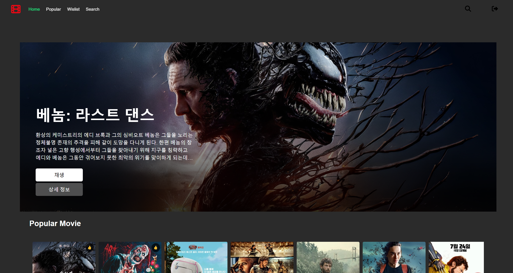

# TMDB 기반 영화 웹사이트 (Vue.js)

Vue.js와 TMDB API를 활용한 영화 정보 제공 사이트입니다. 사용자들은 최신 영화, 인기 영화, 개봉 예정 영화, 최고 평점 영화 등 다양한 카테고리의 영화 정보를 탐색하고, 영화 검색 기능을 통해 원하는 영화를 찾을 수 있습니다.

[](https://chanwoo184.github.io/DemoSitedev/)

## 프로젝트 기본 정보

이 프로젝트는 TMDB (The Movie Database) API를 활용하여 넷플릭스와 유사한 영화 정보를 제공하는 웹사이트입니다. 사용자는 인기 영화, 최신 영화, 장르별 영화, 영화 상세 정보 등을 조회할 수 있으며, 개인의 위시리스트에 영화를 추가하는 기능도 포함하고 있습니다. 전체적인 디자인은 넷플릭스의 UI에서 영감을 받아 Vue.js를 사용해 제작되었습니다.

프로젝트 이름: Vue-DemoSite

배포 링크: [Click here](https://chanwoo184.github.io/DemoSitedev/).

## 기술 스택

- 프론트엔드 프레임워크: Vue.js 3

- 스타일링: CSS3, SCSS

- 아이콘: Font Awesome

- API: TMDB API (The Movie Database)

- 라우팅: Vue Router

- 상태 관리: Composition API

- Axios: HTTP 클라이언트로, TMDB API와의 통신을 효율적으로 처리

## 설치 및 실행 가이드 

로컬 환경에서 프로젝트를 실행하려면 아래의 절차를 따라주세요.

### 프로젝트 클론 
```
$ git clone https://github.com/chanwoo184/DemoSitedev.git
```

### 필수 패키지 설치
```
npm install
```

### 로컬 서버 실행
```
npm run serve
```
웹사이트는 기본적으로 http://localhost:8080 에서 확인할 수 있습니다.

### 배포 환경에 사용할 파일 생성
```
npm run build
```

## API
TMDB API를 사용하여 영화 데이터를 가져왔습니다.

[TMDB API](https://www.themoviedb.org/documentation/api)를 회원가입 시 비밀번호로 입력하면 영화 데이터 조회가 가능합니다.\
또한 TMDB API를 사용하기 위해서는 API Key가 필요합니다.\
API Key는 TMDB 사이트에서 발급받을 수 있습니다.

## 기능 소개 

- 영화 검색: 영화 제목을 검색하여 원하는 영화 정보를 확인할 수 있습니다.

- 영화 상세 정보 조회: 특정 영화를 클릭하면 해당 영화의 줄거리, 개봉일, 평점 등을 상세히 볼 수 있습니다.

- 장르별 영화 필터링: 특정 장르의 영화만 필터링해서 볼 수 있습니다.

- 위시리스트: 관심 있는 영화를 위시리스트에 추가할 수 있습니다.

## 프로젝트 구조 설명 

프로젝트 폴더 구조는 다음과 같습니다.
```
├── .github/               # GitHub 관련 설정 파일들
├── dist/                  # 빌드된 정적 파일들이 위치하는 디렉토리
├── node_modules/          # 프로젝트에 사용된 모든 npm 패키지들
├── public/
│   ├── favicon.ico        # 웹사이트 아이콘
│   └── index.html         # 기본 HTML 템플릿
├── src/                   # 프로젝트의 소스 코드
│   ├── assets/            # 정적 자원들 (이미지, 스타일 등)
│   ├── components/        # 재사용 가능한 Vue 컴포넌트들
│   │   ├── home/          # 홈 관련 컴포넌트들
│   │   ├── layout/        # 레이아웃 관련 컴포넌트들
│   │   ├── search/        # 검색 관련 컴포넌트들
│   │   └── sign-in/       # 로그인 관련 컴포넌트들
│   ├── guards/            # 라우터 가드 관련 코드 (인증 관련)
│   │   ├── authGuard.d.ts # 인증 가드 TypeScript 타입 정의
│   │   └── authGuard.js   # 인증 가드 
│   ├── models/            # 데이터 모델 정의
│   │   └── types.ts       # 타입스크립트 타입 정의 파일
│   ├── router/            # 라우터 관련 코드
│   │   └── index.ts       # 라우터 설정 파일
│   ├── util/              # 유틸리티 함수 및 API 호출 관련 코드
│   │   ├── auth/          # 인증 관련 유틸리티
│   │   ├── movie/         # 영화 관련 유틸리티
│   │   └── util.vue       # 일반 유틸리티 파일
│   ├── views/             # 페이지 뷰 컴포넌트들
│   │   ├── home-main/     # 홈 메인 페이지 관련 뷰
│   │   ├── home-wishlist/ # 위시리스트 페이지 관련 뷰
│   │   ├── scroll/        # 무한 스크롤 관련 뷰
│   │   ├── search/        # 검색 페이지 관련 뷰
│   │   ├── views/         # 다양한 뷰 컴포넌트들
│   │   ├── MovieDetail.vue # 영화 상세 정보 뷰 컴포넌트
│   │   ├── MovieSearching.vue # 영화 검색 뷰 컴포넌트
│   │   └── view.vue       # 뷰 파일
│   ├── App.vue            # 루트 컴포넌트
│   ├── main.ts            # 애플리케이션 엔트리 포인트
│   ├── shims-vue.d.ts     # Vue 파일을 TypeScript에서 인식하기 위한 설정
│   └── style.css          # 글로벌 스타일 시트
```